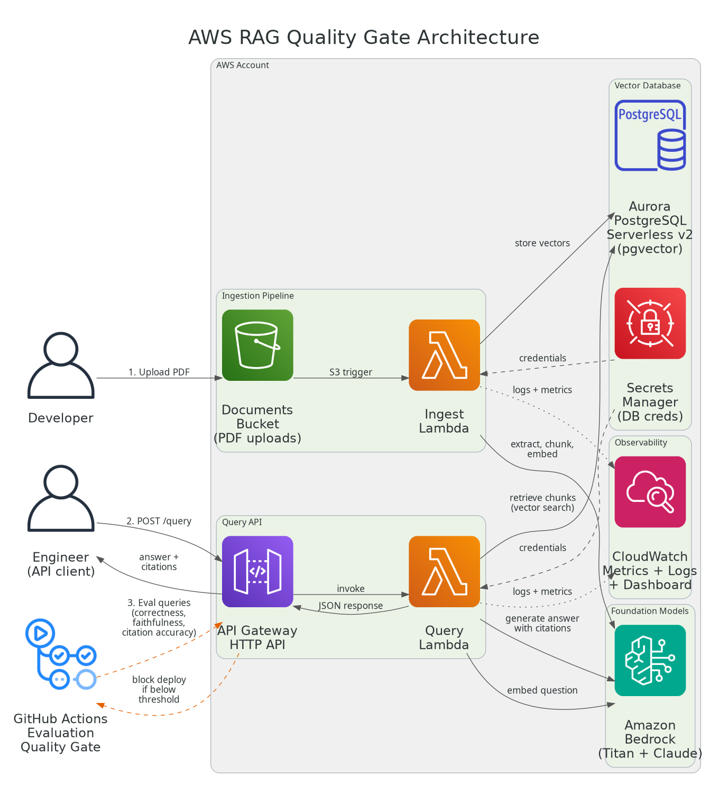

# AWS RAG Quality Gate Starter

[](https://github.com/saranreddy/aws-rag-quality-gate-starter/actions/workflows/ci.yml)
[](https://opensource.org/licenses/MIT)
[](https://www.python.org/downloads/)
[](https://www.terraform.io/)

Download-and-apply AWS RAG starter: production document Q&A with citations on Bedrock + Aurora pgvector, with an automated evaluation quality gate (Terraform).

Built for clarity, maintainability, and professional RAG engineering on AWS.

## Who This Is For

This starter is for teams building production-ready retrieval-augmented generation (RAG) systems on AWS with quality assurance.

**Good fit when you need:**
- Document Q&A with verifiable citations (legal, compliance, enterprise knowledge bases)
- Vector search on your own documents without vendor lock-in to managed services
- Automated evaluation gates to catch regressions before deployment
- Infrastructure-as-code for reproducible RAG deployments
- Cost-effective serverless architecture with automatic scaling (Aurora scales from 0.5 ACU minimum)

**Common in these contexts:**
- Legal tech, compliance, and regulated industries requiring citation traceability
- Enterprise teams building internal knowledge bases on proprietary documents
- Platform/ML engineers establishing RAG standards for their organization
- Teams graduating from prototypes (LangChain notebooks) to production systems

**Not a good fit for:**
- Simple chatbot demos without citation requirements (use Bedrock Knowledge Bases or third-party RAG services)
- Real-time streaming or conversational memory (this starter is stateless, single-turn Q&A)
- Multi-modal RAG (images, video, audio)—this starter handles PDFs only
- Teams avoiding self-managed infrastructure (consider fully managed alternatives like AWS Kendra or third-party RAG platforms)

## Features

- **Production RAG Pipeline** with document upload → ingest → chunk → embed → query with citations
- **Vector Database** using Aurora PostgreSQL Serverless v2 with pgvector (self-managed, no vendor lock-in)
- **Amazon Bedrock Integration** for embeddings (Titan v2) and LLM (Claude via cross-region inference profiles)
- **Automated Quality Gate** with LLM-as-judge evaluation (correctness, faithfulness, citation accuracy)
- **Infrastructure as Code** with Terraform (VPC, Lambda, Aurora, API Gateway, CloudWatch)
- **CI/CD Ready** with GitHub Actions for linting, testing, Terraform validation, and evaluation gates
- **Cost-Conscious** with Aurora serverless scaling (0.5 ACU minimum) and Lambda pay-per-use
- **Citation Tracking** with source document, page number, and snippet for every answer

## Architecture



*Diagram generated from `docs/architecture.py` (requires `pip install diagrams` and Graphviz; run `python docs/architecture.py` to regenerate)*

## Prerequisites

- **AWS Account** with permissions for VPC, S3, Lambda, RDS Aurora, Secrets Manager, API Gateway, Bedrock
- **AWS CLI** configured (`aws configure`)
- **Python 3.10+** installed locally
- **Terraform 1.0+** installed locally
- **Bedrock Model Access** enabled in AWS Console (⚠️ **Required before deployment**):
  - Go to AWS Console → Bedrock → Model access → Manage model access
  - Enable access for:
    - **Amazon Titan Text Embeddings v2** (`amazon.titan-embed-text-v2:0`) - open access
    - **Anthropic Claude models** require submitting the **one-time Anthropic use-case form** in the Bedrock console before any Claude model can be invoked
  - This starter uses cross-region inference profiles (e.g. `us.anthropic.claude-sonnet-4-6`) for improved availability
  - Model IDs verified from: [AWS Bedrock Claude documentation](https://docs.aws.amazon.com/bedrock/latest/userguide/models-supported.html)
  - Model access approval is typically instant for Titan; Anthropic form approval may take a few minutes

## Quick Start

### Step 1: Clone and Install Dependencies

```bash
git clone https://github.com/saranreddy/aws-rag-quality-gate-starter.git
cd aws-rag-quality-gate-starter

# Create virtual environment
python -m venv venv
source venv/bin/activate  # On Windows: venv\Scripts\activate

# Install dependencies
pip install -r requirements.txt
```

### Step 2: Build Lambda Deployment Packages

Before deploying, build the Lambda packages with their dependencies:

```bash
# From the project root
./scripts/build_lambdas.sh
```

This creates deployment packages in `infra/build/` with all required Python dependencies (psycopg2, pgvector, pypdf, etc.) compiled for the Lambda runtime.

**Note**: The build script requires Docker or a Linux environment for `manylinux2014_x86_64` binaries. On macOS/Windows, the pip install uses platform-specific flags to ensure Lambda compatibility.

### Step 3: Deploy Infrastructure with Terraform

```bash
cd infra

# Initialize Terraform
terraform init

# Customize variables (optional)
cp terraform.tfvars.example terraform.tfvars
# Edit terraform.tfvars with your desired values

# Review and deploy
terraform plan
terraform apply  # Type 'yes' when prompted
```

**Deployment time**: ~10-15 minutes (mostly Aurora cluster creation)

**Save the outputs**:

```bash
terraform output
```

Copy these to `config/config.yaml` in the next step.

### Step 4: Configure the RAG System

```bash
cd ..
cp config/config.example.yaml config/config.yaml
```

Edit `config/config.yaml` with values from `terraform output`:

```yaml
aws_region: us-east-1
db_host: <db_host from terraform output>
db_port: 5432
db_name: ragdb
db_secret_name: <db_secret_name from terraform output>
documents_bucket: <documents_bucket from terraform output>
api_gateway_url: <api_gateway_url from terraform output>
# ... (see config.example.yaml for full structure)
```

### Step 5: Upload and Ingest Documents

Upload a PDF to the documents bucket (triggers automatic ingestion):

```bash
aws s3 cp sample-document.pdf s3://$(cd infra && terraform output -raw documents_bucket)/sample-document.pdf
```

Monitor ingestion in CloudWatch Logs:

```bash
aws logs tail /aws/lambda/rag-quality-gate-ingest-processor --follow
```

### Step 6: Query the API

```bash
curl -X POST $(cd infra && terraform output -raw query_endpoint) \
  -H "Content-Type: application/json" \
  -d '{
    "question": "What is the main topic discussed in the document?"
  }' | jq .
```

**Response format**:

```json
{
  "answer": "The document discusses... [1] and mentions... [2]",
  "citations": [
    {
      "number": 1,
      "source": "sample-document.pdf",
      "page": 3,
      "snippet": "The relevant text from page 3..."
    },
    {
      "number": 2,
      "source": "sample-document.pdf",
      "page": 5,
      "snippet": "Another relevant excerpt..."
    }
  ],
  "token_usage": {
    "input_tokens": 1250,
    "output_tokens": 180
  },
  "latency_ms": 3420,
  "retrieved_chunks": 5
}
```

### Step 7: Run Evaluation Quality Gate

Upload evaluation documents:

```bash
aws s3 cp eval/documents/ s3://$(cd infra && terraform output -raw documents_bucket)/ --recursive
```

Run the evaluation script:

```bash
python scripts/run_eval.py
```

The script will:
1. Query the RAG system with each question in `eval/dataset.jsonl`
2. Evaluate correctness (vs expected answer)
3. Evaluate faithfulness (answer grounded in context)
4. Evaluate citation accuracy (sources match expected)
5. Check against thresholds in `config/config.yaml`
6. Exit with code 0 (pass) or 1 (fail) for CI/CD integration

**Output**:

```
============================================================
EVALUATION QUALITY GATE
============================================================
correctness         : 0.825 (threshold: 0.700) ✓ PASS
faithfulness        : 0.890 (threshold: 0.800) ✓ PASS
citation_accuracy   : 0.920 (threshold: 0.900) ✓ PASS
============================================================
✓ All metrics passed! Quality gate: PASS
============================================================
```

Reports are saved to `eval/reports/` as JSON and Markdown.

### Step 7: Monitor in CloudWatch

View the dashboard:

```bash
cd infra
terraform output cloudwatch_dashboard_url
```

Metrics include:
- Lambda invocations and errors
- Query latency (average and p99)
- Aurora ACU utilization and connections
- API Gateway request counts and errors

### Step 8: Clean Up Resources

```bash
cd infra
terraform destroy  # Type 'yes' when prompted
```

**Important**: This deletes all resources, including the Aurora cluster and S3 buckets with their contents. Back up any important data first.

## Project Structure

```
.
├── config/
│   └── config.example.yaml       # Configuration template
├── infra/                        # Terraform infrastructure
│   ├── main.tf                   # Provider configuration
│   ├── variables.tf              # Input variables
│   ├── s3.tf                     # S3 buckets
│   ├── vpc.tf                    # VPC, subnets, NAT Gateway
│   ├── rds.tf                    # Aurora PostgreSQL with pgvector
│   ├── lambda.tf                 # Lambda functions (ingest, query)
│   ├── api_gateway.tf            # API Gateway HTTP API
│   ├── iam.tf                    # IAM roles and policies
│   ├── cloudwatch.tf             # Dashboard and alarms
│   ├── outputs.tf                # Output values
│   ├── db_init.py                # Database initialization script
│   ├── terraform.tfvars.example  # Variable values template
│   └── README.md                 # Infrastructure documentation
├── src/
│   ├── rag/                      # RAG core functionality
│   │   ├── __init__.py
│   │   ├── config.py             # Configuration management
│   │   ├── ingest.py             # Document ingestion
│   │   ├── query.py              # Query handling
│   │   └── evaluation.py         # Evaluation framework
│   └── lambda_handlers/          # Lambda entry points
│       ├── ingest_handler.py     # S3-triggered ingest
│       └── query_handler.py      # API Gateway query handler
├── scripts/
│   └── run_eval.py               # Evaluation quality gate script
├── tests/
│   ├── conftest.py               # Pytest fixtures
│   └── unit/                     # Unit tests
│       ├── test_config.py
│       ├── test_ingest.py
│       ├── test_query.py
│       └── test_evaluation.py
├── eval/
│   ├── dataset.jsonl             # Evaluation questions
│   ├── documents/                # Sample documents for eval
│   └── README.md                 # Dataset documentation
├── docs/
│   ├── architecture.py           # Diagram generation script
│   └── architecture.png          # Architecture diagram
├── .github/
│   └── workflows/
│       └── ci.yml                # GitHub Actions CI/CD
├── pyproject.toml                # Python project metadata
├── requirements.txt              # Python dependencies
├── .gitignore
├── LICENSE
└── README.md
```

## How It Works

### Ingestion Pipeline

1. **Upload**: User uploads PDF to S3 documents bucket
2. **Trigger**: S3 event triggers ingest Lambda function
3. **Extract**: Lambda downloads PDF and extracts text per page
4. **Chunk**: Text split into overlapping chunks (default 512 chars, 50 overlap)
5. **Embed**: Each chunk embedded using Bedrock Titan Text Embeddings v2 (1024 dimensions)
6. **Store**: Chunks + embeddings + metadata stored in Aurora PostgreSQL with pgvector
7. **Index**: Vector similarity index (IVFFlat) created for fast retrieval

### Query Pipeline

1. **Request**: Client POSTs `{"question": "..."}` to API Gateway
2. **Embed**: Lambda embeds question using same Bedrock embedding model
3. **Retrieve**: Vector similarity search in Aurora pgvector (cosine distance, top-k)
4. **Generate**: Bedrock Claude receives question + context chunks with strict grounding prompt
5. **Citations**: Answer includes numbered citations `[1]`, `[2]` referencing sources
6. **Response**: JSON with answer, citations (source, page, snippet), tokens, latency

### Evaluation Quality Gate

1. **Dataset**: `eval/dataset.jsonl` contains questions with expected answers and sources
2. **Query**: Script queries RAG system with each question
3. **Evaluate**:
   - **Correctness**: LLM-as-judge scores answer vs expected (0-1)
   - **Faithfulness**: LLM-as-judge scores answer groundedness in retrieved context (0-1)
   - **Citation Accuracy**: Jaccard similarity + citation usage (0-1)
4. **Aggregate**: Average scores across all questions
5. **Threshold Check**: Fail if any metric below configured threshold
6. **Report**: JSON + Markdown reports saved to `eval/reports/`
7. **Exit Code**: 0 (pass) or 1 (fail) for CI/CD

## Configuration Options

Edit `config/config.yaml` to customize RAG behavior:

| Parameter | Description | Default |
|-----------|-------------|---------|
| `embedding_model_id` | Bedrock embedding model | `amazon.titan-embed-text-v2:0` |
| `llm_model_id` | Bedrock LLM for answers | `anthropic.claude-3-5-sonnet-20241022-v2:0` |
| `chunk_size` | Chunk size in characters | 512 |
| `chunk_overlap` | Overlap between chunks | 50 |
| `top_k` | Number of chunks to retrieve | 5 |
| `eval_thresholds.correctness` | Correctness threshold | 0.7 |
| `eval_thresholds.faithfulness` | Faithfulness threshold | 0.8 |
| `eval_thresholds.citation_accuracy` | Citation accuracy threshold | 0.9 |

Terraform variables (in `infra/terraform.tfvars`):

| Variable | Description | Default |
|----------|-------------|---------|
| `aws_region` | AWS region | `us-east-1` |
| `db_min_capacity` | Aurora min ACUs | 0.5 |
| `db_max_capacity` | Aurora max ACUs | 2 |
| `chunk_size` | Chunk size (also set in Lambda env) | 512 |

## Cost Considerations

Estimated monthly costs for moderate usage (~5,000 queries/month, 100 documents):

| Resource | Monthly Cost Estimate |
|----------|----------------------|
| Aurora Serverless v2 (0.5-2 ACU) | $40-160 (scales with usage) |
| Lambda invocations | $2-5 |
| **NAT Gateway** | **$32/month (fixed) + $0.045/GB data transfer** |
| S3 storage | $1-5 (depends on document volume) |
| Bedrock (Titan + Claude) | $10-50 (depends on query volume) |
| API Gateway | $1/million requests (~$0.01) |
| CloudWatch Logs | $1-2 |
| VPC Endpoints (optional) | $14/month (eliminates NAT data charges) |
| **Estimated Total** | **$90-265/month** |

**Cost drivers:**
- **Aurora** is the largest fixed cost (even at minimum 0.5 ACU)
- **NAT Gateway** is the second-largest fixed cost ($32/month + data transfer)
- **Bedrock** costs scale with query volume (embedding + LLM tokens)

**Cost optimization:**
- Aurora scales to 0.5 ACU when idle (lower `db_max_capacity` to cap costs)
- **Eliminate NAT Gateway data charges**: Enable VPC endpoints (set `enable_vpc_endpoints = true` in `infra/terraform.tfvars`). This adds ~$14/month for interface endpoints but eliminates per-GB data transfer charges through NAT ($0.045/GB). Break-even point: ~300 GB/month of Bedrock traffic.
- Reduce `top_k` to retrieve fewer chunks (lower embedding costs)
- Use cheaper embedding models (e.g., `amazon.titan-embed-text-v1`)
- Use cheaper LLMs (e.g., Claude Haiku instead of Sonnet)

**Unverified**: Aurora Serverless v2 minimum 0.5 ACU cost and Bedrock token costs could not be verified without deployment. Consult AWS pricing calculator for your specific usage.

## Development

### Running Tests

```bash
# Run unit tests
pytest tests/unit/ -v

# Run with coverage
pytest tests/unit/ --cov=src --cov-report=html

# Lint
ruff check src/ scripts/ tests/
```

### Validating Terraform

```bash
cd infra
terraform fmt -check -recursive
terraform validate
```

### Regenerating Architecture Diagram

```bash
# Install diagrams and Graphviz
pip install diagrams
# On macOS: brew install graphviz
# On Ubuntu: sudo apt install graphviz

# Generate diagram
python docs/architecture.py
```

## CI/CD

The included GitHub Actions workflow (`.github/workflows/ci.yml`) runs on every push and PR:

1. **Lint and Test** (Python 3.10, 3.11):
   - Ruff linting
   - Unit tests with pytest
2. **Terraform Validate**:
   - `terraform fmt -check`
   - `terraform validate`
3. **Evaluation Gate** (on push to `main` only):
   - Runs `scripts/run_eval.py` against deployed endpoint
   - Requires AWS credentials configured (OIDC role)
   - Fails build if any metric below threshold
   - Skips gracefully if AWS credentials not configured

**To enable AWS evaluation gate**:

1. Set up OIDC with AWS (see [aws-terraform-remote-state-starter](https://github.com/saranreddy/aws-terraform-remote-state-starter))
2. Add GitHub secrets:
   - `AWS_REGION`: Your AWS region
   - `AWS_ROLE_ARN`: IAM role for GitHub Actions

## Troubleshooting

### Ingest Lambda Timeout

**Symptom**: Lambda times out processing large PDFs

**Fix**:
- Increase timeout in `infra/lambda.tf` (default 300s)
- Split large PDFs into smaller files
- Check CloudWatch Logs for specific errors

### Database Connection Failures

**Symptom**: Lambda logs show "connection refused" or timeout

**Fix**:
- Verify Lambda is in same VPC as Aurora (check `infra/vpc.tf`)
- Check security group allows Lambda → Aurora on port 5432
- Confirm Secrets Manager secret exists and has correct credentials

### Bedrock Access Denied

**Symptom**: `AccessDeniedException` when invoking Bedrock

**Fix**:
- Enable model access in Bedrock console (see Prerequisites)
- Verify IAM role has `bedrock:InvokeModel` permission
- Check model ID is correct for your region (some models are region-specific)

### High Costs

**Symptom**: AWS bill higher than expected

**Fix**:
- Check Aurora ACU usage in CloudWatch (largest cost)
- Reduce `db_max_capacity` in `infra/terraform.tfvars`
- Monitor Bedrock token usage (input + output tokens)
- Review NAT Gateway data transfer (second-largest cost)
- Consider destroying resources when not in use (`terraform destroy`)

### Evaluation Fails on Fresh Deploy

**Symptom**: Evaluation script fails with "I don't know" answers

**Fix**:
- Ensure evaluation documents are uploaded to S3 documents bucket
- Wait for ingest Lambda to finish processing (check CloudWatch Logs)
- Verify Aurora has chunks stored: query database directly or check CloudWatch metrics

## Customization Guide

### Using a Different Embedding Model

Edit `config/config.yaml` and `infra/variables.tf`:

```yaml
embedding_model_id: cohere.embed-english-v3
```

Update embedding dimension in `infra/db_init.py`:

```python
embedding vector(1024)  # Titan v2 is 1024; adjust for other models
```

### Using a Different LLM

Edit `config/config.yaml`:

```yaml
llm_model_id: anthropic.claude-3-haiku-20240307-v1:0  # Cheaper, faster
# OR
llm_model_id: meta.llama3-70b-instruct-v1:0  # Open source
```

Update prompt in `src/rag/query.py` if needed (different models may require different prompting styles).

### Adding Support for DOCX or TXT

1. Install `python-docx` (already in `requirements.txt`)
2. Add extraction function in `src/rag/ingest.py`:

```python
def extract_text_from_docx(docx_path: str) -> List[Tuple[str, int]]:
    doc = Document(docx_path)
    # ... implementation
```

3. Update `process_document()` to dispatch by file extension
4. Update S3 notification filter in `infra/s3.tf` to include `.docx`

### Swapping Aurora for Amazon OpenSearch

1. Replace `infra/rds.tf` with `infra/opensearch.tf`
2. Update `src/rag/ingest.py` and `src/rag/query.py` to use OpenSearch Python client
3. Change vector index from pgvector to OpenSearch k-NN

## Contributing

Contributions welcome! This is a starter template meant to be forked and customized.

If you find issues or have improvements:
1. Fork the repository
2. Create a feature branch
3. Submit a pull request

## License

MIT License - see [LICENSE](LICENSE) file for details.

## Acknowledgments

- Built with [AWS Bedrock](https://aws.amazon.com/bedrock/), [Aurora PostgreSQL](https://aws.amazon.com/rds/aurora/), and [pgvector](https://github.com/pgvector/pgvector)
- Infrastructure automation with [Terraform](https://www.terraform.io/)
- Inspired by production RAG patterns from enterprise deployments

---

**Author**: [Saran Alla](https://github.com/saranreddy)

**Project**: Production RAG with citations and automated quality gates on AWS

**Questions?** Open an issue or check the [troubleshooting section](#troubleshooting) above.
